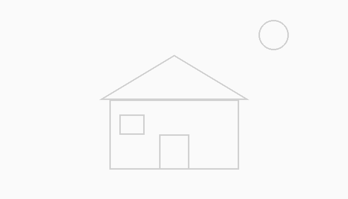
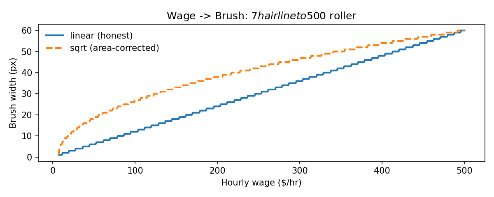
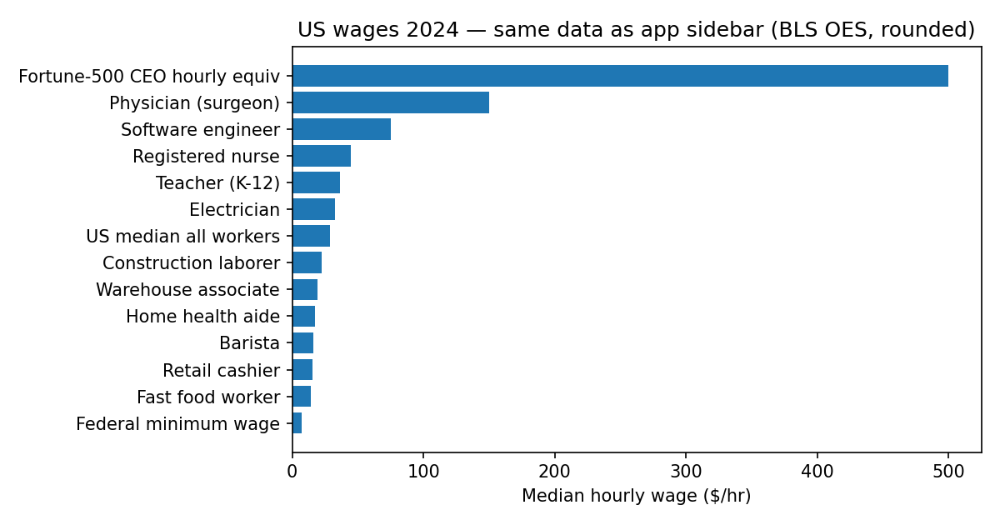

# 🖌️ Wage Brush Economics

[](https://wage-brush-economics.streamlit.app/)

> **Your brush size = your wage.** Income inequality you can paint.
>
> 🎨 **Try it live: https://wage-brush-economics.streamlit.app/**

Move a wage slider from **$7 → $500/hr**. Minimum wage paints a thin
hairline 🪡. CEO pay paints a giant roller 🧱. Draw the *same house*
with both brushes — and feel labor value.

Built with `streamlit` + `streamlit-drawable-canvas` in ~120 lines of app code.

## 🖼️ Gallery

| House reference (in-app trace guide) | Wage → brush mapping |
|---|---|
|  |  |


*Same BLS-anchored data as the app sidebar — $7.25 minimum wage to $500 CEO cap.*

## ✨ What it does

- **🎨 Free paint** — wage slider maps to brush width (1px → 60px), with
  linear (honest) or sqrt (area-corrected) scaling + a traceable house template
- **⚖️ Same-house challenge** — side-by-side canvases: $7.25 minimum wage
  vs $500 CEO. Same task, wildly different tools
- **💼 Occupation presets** — barista → nurse → SWE → surgeon → CEO
- **💰 Labor-value panel** — paint-per-stroke multiplier, hours to afford
  $2k rent and a $450k house at your wage
- **📊 Wage data** — `data/wages_2024.csv` (BLS OES 2024, rounded) wired
  into a sidebar distribution chart

## 🚀 Run it

```bash
pip install -r requirements.txt
streamlit run app.py
```

## 🧠 The economics

Brush width is a metaphor for **effective agency per hour**:

- `wage_to_brush()` in `src/economics.py` maps $7–$500 → 1–60px
- `paint_multiplier()` shows a CEO lays ~60× more paint per stroke
- `hours_to_earn()` converts any price into hours of life:
  $2k rent = 276h at $7.25 vs 4h at $500

Linear scaling tells the truth. Sqrt scaling keeps the CEO canvas usable —
itself a lesson: extreme inequality breaks normal tools.

## 📁 Structure

```
app.py                  # Streamlit UI (canvas + tabs + metrics)
src/economics.py        # wage→brush, labels, labor math
src/presets.py          # job presets
src/house.py            # PIL house-template generator
data/wages_2024.csv     # BLS-anchored wage bands
.streamlit/config.toml  # warm gallery theme
tests/test_economics.py # brush-scaling tests
```

## 📚 Data sources

- BLS Occupational Employment & Wages (OES), May 2024 — medians rounded
- Federal minimum wage $7.25 (FLSA, unchanged since 2009)
- CEO hourly equiv capped at $500 for drawability (AFL-CIO paywatch reports
  far higher realized comp; the cap is a canvas constraint, noted in-app)

## 🤝 Contributing

Paint first, then PR. If you add a preset, cite BLS/OES or a public pay
report and keep `data/wages_2024.csv` sorted low → high.
